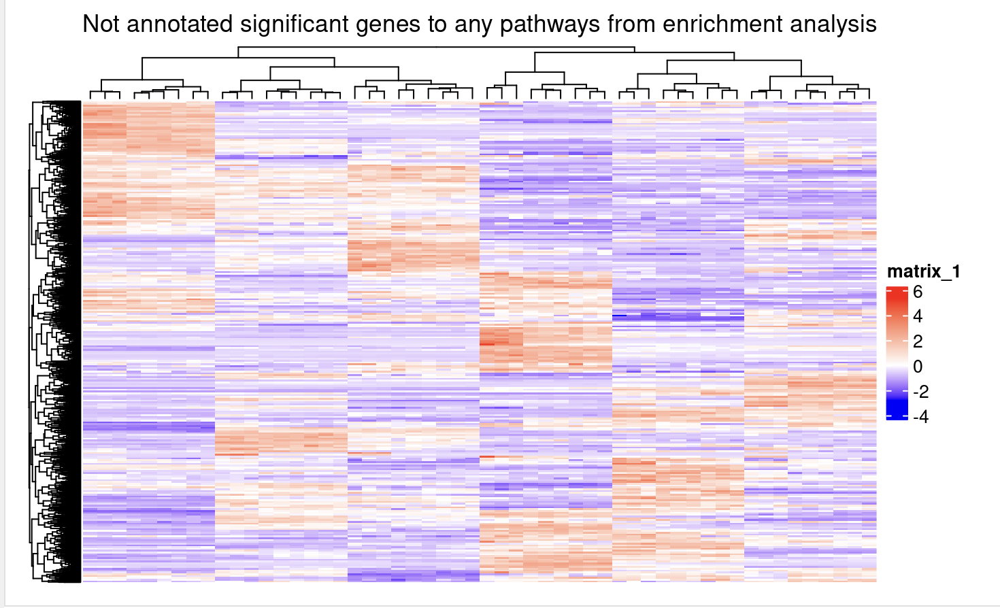
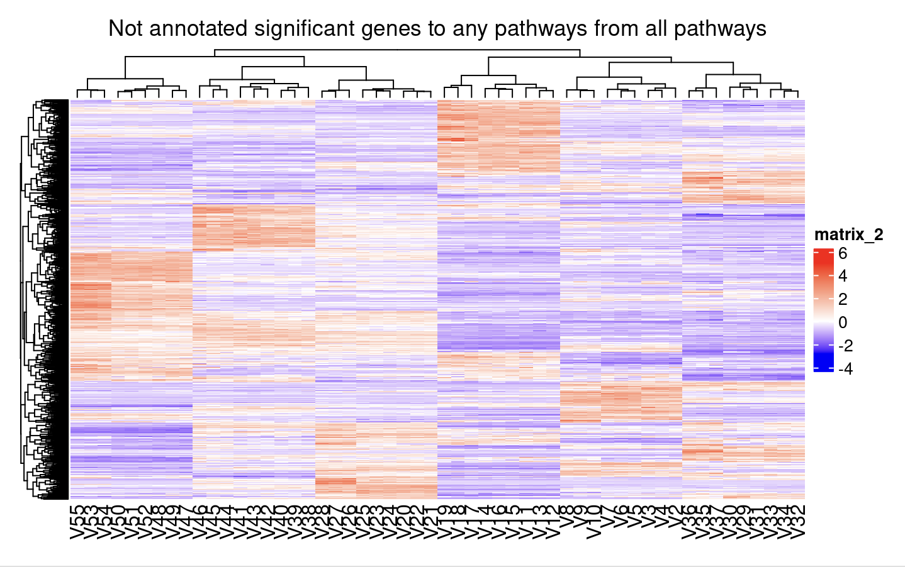

# Introduction 

This study is based on the data set collected from GSE212591. The study focused on the efficacy of azacitidine and decitabine treatments for infant acute lymphoblastic leukemia (ALL). The data handling involved removing duplicates and unmapped genes and was followed by normalization using the Trimmed Mean of M-values (TMM). This was completed to ensure the data set can be compared across different library sizes and treatment conditions.

Using the normalized data, multidimensional scaling (MDS) and dispersion analysis was applied to assess the differential gene expression. MDS provided a visual representation of the treatment effects and showed different clustering of samples based on treatment type. The results showed significant differences in gene expression patterns among azacitidine and decitabine treatments. To elaborate more on the analysis, dispersion analysis further highlighted the variability in gene expression. There was a notably high differentially expressed genes in decitabine-treated samples compared to controls and azacitidine treatments. This suggested that using both decitabine and azacitidine may be helpful in treating ALL. 

G:Profiler was run on the data set to identify the up-regulated and down-regulated pathways. It was found that myeloid leukocyte activation was up-regulated and DNA-templated DNA replication was down regulated. Now, non-threshold analysis will be conducted to further analyse the data followed by graphing the network.

# Downloads
```{r setup_A3, message=FALSE}
options(repos = c(CRAN = "https://cran.rstudio.com/"))
install.packages("GSA")

if (!requireNamespace("circlize", quietly = TRUE))
    install.packages("circlize")
library(circlize)

if (!requireNamespace("BiocManager", quietly = TRUE))
    install.packages("BiocManager")
library(BiocManager)
BiocManager::install("edgeR")
BiocManager::install("ComplexHeatmap")
BiocManager::install("gprofiler2")
library(edgeR)
library(gprofiler2)
library(ComplexHeatmap)

if (!requireNamespace("GEOquery", quietly = TRUE))
    BiocManager::install("GEOquery")
library(GEOquery)

```


```{r child = '../A2/A2_JoshiKrutika.Rmd'}
```

# Part 1: Non-thresholded Gene set Enrichment Analysis
```{r}
#path to GSEA jar 
gsea_jar <- "../GSEA_4.3.3/gsea-cli.sh"
working_dir <- "data/"
output_dir <- "./generated_data/"
analysis_name <- "azacitidine_vs_decitabine"

#compute ranks
qlf_output_hits_withgn <- as.data.frame(qlf_output_hits)
qlf_output_hits_withgn$rank <- -log(qlf_output_hits_withgn$PValue, base = 10) * sign(qlf_output_hits_withgn$logFC)
qlf_output_hits_withgn <- qlf_output_hits_withgn[order(qlf_output_hits_withgn$rank), ]

#sort table by ranks
qlf_output_hits_withgn <- qlf_output_hits_withgn[order(qlf_output_hits_withgn$rank, decreasing = TRUE),]
qlf_output_hits_withgn$gene_name <- rownames(qlf_output_hits_withgn)
rank_file <- qlf_output_hits_withgn[, c("gene_name", "rank")]
# Write it to a .rnk file
write.table(rank_file, file = "./data/azacitvsdecit_RNASeq_ranks.rnk", sep = "\t", quote = FALSE, row.names = FALSE)
rnk_file <- "azacitvsdecit_RNASeq_ranks.rnk"

run_gsea <- FALSE
dest_gmt_file = file.path(output_dir, "Human_GOBP_AllPathways_noPFOCR_with_GO_iea_March_01_2024_symbol.gmt")

# Run GSEA 
if(run_gsea){
  command <- paste("",gsea_jar,  
                   "GSEAPreRanked -gmx", dest_gmt_file, 
                   "-rnk" ,file.path(working_dir, rnk_file), 
                   "-collapse false -nperm 1000 -scoring_scheme weighted", 
                   "-rpt_label ",analysis_name,
                   "  -plot_top_x 20 -rnd_seed 12345  -set_max 200",  
                   " -set_min 15 -zip_report false ",
                   " -out" ,output_dir, 
                   " > gsea_output.txt",sep=" ")
  system(command)
}
```

1.) What method did you use? What genesets did you use? Make sure to specify versions and cite your methods.

- I used the GSEAPreRanked method that is part of the GSEA package [@subramanian_gene_2005 and @mootha_pgc-1-responsive_2003]. This method takes in a data file that already has the genes ranked (which is why it is named PreRanked). The ranking for each gene is based on the negative log of the P-value and sign of logFC value of azacitidine and decitabine. 

The gene set I used was a .gmt file taken from the Bader lab labeled as "Human_GOBP_AllPathways_noPFOCR_with_GO_iea_March_01_2024_symbol.gmt". Based on the title of these gene set, it is evident that the gene set pertains to humans. It contains Gene Ontology Biological Processes(GOBP) which can be used in identifying molecular functions. The keyword AllPathways suggests that all biological pathways are present.   

The version of GSEA I used was 4.3.3. The version of the gene set I used was dated March 1, 2024.  


2.) Summarize your enrichment results.

- Based on the results, there were 3089 gene sets that were up-regulated out of 5074. Out of the 3089 gene sets, only 421 gene sets had an FDR value of below 0.25. Identifying gene sets under this FDR value helps identify the pathways with stronger relevance. There were 257 genes set with p-value of less than 0.01 and 554 gene sets with p-value of 0.05. The up-regulated enrichment result stated LEUKOCYTE CHEMOTAXIS%GOBP%GO:0030595 as the top pathway. This pathway had an enrichment score of 0.79607016 which represents a significant over representation of this pathway compared to the other up-regulated genes. The FDR value received for this pathway is 0 which indicates that after correcting for multiple hypothesis testing, the significance is still high. 


- In terms of the down regulated gene sets, 1985 out of 5074 gene sets were down regulated. Out of the 1985, only 89 gene sets were significantly enriched at FDR value of 0.25. Which means about 89 gene sets were most likely significantly down regulated after correcting for multiple hypothesis testing. 97 gene sets were significantly enriched at the pvalue of 0.01 and 260 gene sets are significantly enriched at pvalue of 0.05. The top pathway that was downregulated was PROTEINOGENIC AMINO ACID METABOLIC PROCESS%GOBP%GO:0170039 with the ES of -0.68892586. This suggests that there is a significant under representation of this pathway compared to the other down-regulated genes. This has a FDR value of 0.001806672 which suggests a high significance of this pathway to down-regulation. 

3.) How do these results compare to the results from the thresholded analysis in Assignment #2. Compare qualitatively. Is this a straight forward comparison? Why or why not?

When comparing G:Profiler with GSEA, due to the methodologies and the gene sets used being different, I don't think the comparison is very straightforward. That being said there are some aspects that are straight forward such as finding the general theme.

For example, G:Profiler identified myeloid leukocyte activation as a top up-regulated gene set, while GSEA highlighted Leukocyte Chemotaxis. Both terms relate to the activation and movement of leukocytes, suggesting an increase in the immune response. Due to this common instance in both the G:Profiler and GSEA, it can we seen that the treatment appears to influence the immune system.Same with down regulation where G:Profiler said DNA-templated DNA replication pathway was down regulated meanwhile GSEA said proteinogenic amino acid metabolic process was down regulated. Both of these pathway seem to suggest reduction in the metabolic activities.

Now focusing on the complexities, G:Profiler and GSEA use different methods. G:Profiler looks at the overrepresentation of gene sets that is defined as upregulated or downregulated genes though a threshold value. But, GSEA does not use a threshold value and focuses on the enrichment value instead. This allows GSEA to examine genes without the needed to state if they are up or down regulated. Now focusing on the interpretation of the data, although the results might suggest an overall theme, the specific pathways vary. Like for example leukocyte chemotaxis implies recruitment of immune cells to a specific infected location but myeloid leukocyte activation indicates a general upregulation of immune cells activity. 

# Part 2: Visualize your Gene set Enrichment Analysis in Cytoscape


1.) Using your results from your non-thresholded gene set enrichment analysis visualize your results in Cytoscape. Create an enrichment map - how many nodes and how many edges in the resulting map? What thresholds were used to create this map? Make sure to record all thresholds. Include a screenshot of your network prior to manual layout.

- There are 74 nodes and 134 edges in the map. The threshold used for the node cut off was 0.05 and the edge cut of was 0.375. All the other parameters were set to default. The image above shows the map before any layout manipulation. 

Nodes in the map represent gene sets. The node size represents the number of genes in the gene set and the edges represent overlap between gene sets. The thicker the edge, the higher the number of genes that overlap between the two nodes. The legend is red represents Azacitidine and blue represents Decitabine. 

2.) Annotate your network - what parameters did you use to annotate the network. If you are using the default parameters make sure to list them as well.


For the creation of the clustered image, I used the default parameters present. The clustering algorithm used is MCL Clustering with the edge weight option as similarity_coefficeint. The max word per labels were 3 and the min word label was 1. The adjacent word bonus was set to 8. In addition, I clicked on the "Publication-Ready" option so that question 3 is completed. 

3.) Make a publication ready figure - include this figure with proper legends in your notebook.

- Attached in the second image 

4.) Collapse your network to a theme network. What are the major themes present in this analysis? Do they fit with the model? Are there any novel pathways or themes?


- The major theme present in this network are chemotaxis neurophil migration, organization extracurricular matrix and mitochondrial gene translation. These pathways do fit the model as these pathways seem to have a large overlap in the general theme of increased immune response and decresed DNA replication. 

Some of the pathways are upregulated and others are down regulated. There are some novel pathways such as organization extracurricular matrix and mitochondrial gene translation but there are some old pathways too such as chemotaxis neurophil migration. There are some pathways which are very similar on the clustered table versus the theme network. For example, tissue migration epithelial is present in the clustered pathway network meanwhile tissue migration amebodial is present in the theme network. Both of them are very similar to each other but they do have a notable difference. Overall there seems to be a large overlap between the pathways in the clustered network and the theme network which shows a promising fit within the model. 

# Interpretation and detailed view of results

1.) Do the enrichment results support conclusions or mechanism discussed in the original paper? How do these results differ from the results you got from Assignment #2 thresholded methods

- In the enrichment analysis, it was found that amino acid metabolic processes were downregulated, whereas pathways related to leukocyte chemotaxis were significantly upregulated. These findings support the original paper's discussion of how azacitidine and decitabine could boost immune response and affect gene expression in KMT2A-rearranged infant ALL[@cheung_preclinical_2023-2]. The pathways outputted from GSEA support the hypothesis noted in the paper and suggest the drugs could potentially reactivate tumor suppressor genes. 

GSEA results were different from G:Profiler’s result. G:Profiler examined overrepresented pathways based on upregulated and downregulated genes meanwhile GSEA used the ranked genes to find differentially expressed gene sets and potential pathways. GSEA allowed us to see the pathways that play a significant role in leukemia. In addition, the thresholded analysis emphasized upregulation in leukocyte chemotaxis and down regulation in DNA replication. This gives a very general view of the immune response. Meanwhile GSEA’s pathway allowed for a more focused pathway. In addition, there were some pathways which were present in results created by GSEA but not in G:profiler such as extracellular matrix organization and mitochondrial gene translation. 

This follows the studies that note that the mechanisms followed by azacitidine and decitabine  might exert therapeutic effects[@cheung_preclinical_2023-2]. The results from the assignment suggest that these drugs may have a complex impact on leukemia cells as supported by the study[@cheung_preclinical_2023-2]. The drugs might possibly affect interactions between tumor microenvironment and cellular metabolism[@cheung_preclinical_2023-2].


2.) Can you find evidence, i.e. publications, to support some of the results that you see. How does this evidence support your result?

- There are many publications online that suggest the use of azacitidine and decitabine for therapeutic uses in the domain of ALL[@hong_targeting_2021]. It was noted in a study that upregulating leukocyte chemotaxis pathways would enhance the immune system's ability to combat leukemia[@hong_targeting_2021]. A significant role is played by the immune response in controlling and eliminating cancer cells[@hong_targeting_2021]. In the context of leukemia treatment, these pathways might also be crucial for mobilizing immune cells against cancerous cells in order to improve immune function[@hong_targeting_2021].

By affecting leukemia cell’s metabolic and replicative capacities, azacitidine and decitabine might impair their proliferation and survival[@venugopal_dnmt3a_2022]. As discussed in this paper, targeting DNA replication stress may be an effective strategy in the treatment of cancer[@venugopal_dnmt3a_2022]. According to your enrichment analysis, this study demonstrates how DNA replication pathways are essential for cancer cell survival and proliferation[@venugopal_dnmt3a_2022].

The aim of this review is to explain how metabolic pathways can affect immunity by interfering with amino acid metabolism[@tabe_amino_2019]. The downregulation of amino acid metabolic suggests lower survival rate of leukemia cells aligning with the results produced by examining azacitidine and decitabine[@tabe_amino_2019]. 

# Dark Matter 
```{r, message = FALSE}
# Include a heatmap of any significant genes that are not annotated to any of the pathways returned in the enrichment analysis.

library(GSA)
gmt_file <- file.path(getwd(),"generated_data", "Human_GOBP_AllPathways_noPFOCR_with_GO_iea_March_01_2024_symbol.gmt")
capture.output(genesets<- GSA.read.gmt(gmt_file),file="gsa_load.out")
names(genesets$genesets) <- genesets$geneset.names

expression <- read.table("./data/GSE212591_tmm_counts.txt", stringsAsFactors=FALSE)

ranks <- read.table(file.path(getwd(),"data","azacitvsdecit_RNASeq_ranks.rnk"),
                    header = TRUE, sep = "\t", quote="\"",
                    stringsAsFactors = FALSE)

gsea_directories <- list.files(path = file.path(getwd(),"generated_data"), pattern = "\\.GseaPreranked")

if(length(gsea_directories) == 1){
  gsea_dir <- file.path(getwd(),"generated_data",gsea_directories[1])
  #get the gsea result files
  gsea_results_files <- list.files(path = gsea_dir,
                                   pattern = "gsea_report_*.*.tsv")
  #there should be 2 gsea results files
  enr_file1 <- read.table(file.path(gsea_dir,gsea_results_files[1]),
                          header = TRUE, sep = "\t", quote="\"",
                          stringsAsFactors = FALSE,row.names=1)
  enr_file2 <- read.table(file.path(gsea_dir,gsea_results_files[1]),
                          header = TRUE, sep = "\t", quote="\"",
                          stringsAsFactors = FALSE,row.names=1)
}

#get the genes from the set of enriched pathways (all threshold)
all_enr_genesets<- c(rownames(enr_file1), rownames(enr_file2))
genes_enr_gs <- c()
for(i in 1:length(all_enr_genesets)){
  current_geneset <- unlist(genesets$genesets[which(genesets$geneset.names %in% all_enr_genesets[i])])
  genes_enr_gs <- union(genes_enr_gs, current_geneset)
}

FDR_threshold <- 0.05
#get the genes from the set of enriched pathwasy (no matter what thre
all_sig_enr_genesets <- c(rownames(enr_file1)[which(enr_file1[,"FDR.q.val"] <= FDR_threshold)])
genes_sig_enr_gs <- c()

for(i in 1:length(all_sig_enr_genesets)){
  current_geneset <- unlist(genesets$genesets[which(genesets$geneset.names %in% all_sig_enr_genesets[i])])
  genes_sig_enr_gs <- union(genes_sig_enr_gs, current_geneset)
}

genes_all_gs <- unique(unlist(genesets$genesets))
diff_genes <- rownames(qlf_output_hits[qlf_output_hits$table$FDR <= 0.1, ])

# Heatmap 
dark_matter_genes <- setdiff(diff_genes, genes_enr_gs)
rownames(expression) <- expression$V1
expression <- expression[, -1]
expression_subset_enriched <- expression[dark_matter_genes, ]
expression_subset_enriched_matrix <- as.matrix(expression_subset_enriched)
expression_subset_enriched_matrix <- apply(expression_subset_enriched_matrix, 2, as.numeric)

enrichment_matrix <- t(scale(t(expression_subset_enriched_matrix))) 

if(min(enrichment_matrix) == 0){
  heatmap_col = colorRamp2(c( 0, max(enrichment_matrix)),
                           c( "white", "red"))
  } else {
    heatmap_col = colorRamp2(c(min(enrichment_matrix), 0,
                               max(enrichment_matrix)), c("blue", "white", "red"))
    }

enrichment_heatmap <- Heatmap(as.matrix(enrichment_matrix),
                           cluster_rows = TRUE,
                           cluster_columns = TRUE,
                           show_row_dend = TRUE,
                           show_column_dend = TRUE,
                           col=heatmap_col,
                           show_column_names = FALSE,
                           show_row_names = FALSE,
                           show_heatmap_legend = TRUE,
                           column_title =("Not annotated significant genes to any pathways from enrichment analysis"))


# enrichment_heatmap
# My Mac doesn't allow the loading of a heatmap so I used the online UOFT R server to load the heat map and attached a screen shot here

# All pathways 
dark_matter_genes_all <- setdiff(diff_genes, genes_all_gs)
expression_subset_all <- expression[dark_matter_genes_all, ]
expression_subset_all_matrix <- as.matrix(expression_subset_all)
expression_subset_all_matrix <- apply(expression_subset_all_matrix, 2, as.numeric)
standardized_matrix_all <- t(scale(t(expression_subset_all_matrix))) 

if(min(standardized_matrix_all) == 0){
  heatmap_col = colorRamp2(c( 0, max(standardized_matrix_all)),
                           c( "white", "red"))
  } else {
    heatmap_col = colorRamp2(c(min(standardized_matrix_all), 0,
                               max(standardized_matrix_all)), c("blue", "white", "red"))
    }


all_heatmap <- Heatmap(as.matrix(standardized_matrix_all),
                           show_row_dend = TRUE,show_column_dend = TRUE,
                           col=heatmap_col,show_column_names = TRUE,
                           show_row_names = FALSE,show_heatmap_legend = TRUE,
                           column_title =("Not annotated significant genes to any pathways from all pathways"))
# all_heatmap 
# My Mac doesn't allow the loading of a heatmap so I used the online UOFT R server to load the heat map and attached a screen shot here
```


In the heat map created by examining annotated significant genes to any pathways from enrichment analysis, "CSF3R" was one of the genes present which is part of familial chronic neutrophilic leukemia receptor[@maxson_julia_e_oncogenic_2013]. The Colony Stimulating Factor 3 Receptor is a critical component of the immune system and regulates granulocytes in the blood[@maxson_julia_e_oncogenic_2013]. The heatmap clusters based on the cell lines as it is evident that there is partition. CSF3R is not included in any of the gene sets but has is differential expressed. This is interesting to note as this might suggest that the durgs(i.e Azacitidine and decitabine) affect the chronic neutrophilic leukemia receptor in addition to the other aspects of the immune defense system.  

In the second heatmap created, CD4 is differentially expressed and is not annotated. CD4 is primarily responsible for human defensive mechanisms by recruiting immune cells such as lymphocytes[@khan_comparative_nodate]. Dendritic cells, monocytes, macrophages, and T helper cells contain CD4 glycoprotein on their surfaces [@khan_comparative_nodate]. By recognizing antigens presented by MHC class II molecules, it facilitates the activation of T helper cells in the immune system [@khan_comparative_nodate]. Thus, this might suggest that Azacitidine and decitabine primarily target immuno cells receptors. In addition, the heat map suggest that there are biological conditions in the individuals which cause the expression to differ drastically. 

# References 
Davis, S. and Meltzer, P. S. GEOquery: a bridge between the Gene Expression Omnibus (GEO) and BioConductor. Bioinformatics, 2007, 14, 1846-1847

Gu, Z. (2016) Complex heatmaps reveal patterns and correlations in multidimensional genomic data. Bioinformatics.

Gu, Z. (2014) circlize implements and enhances circular visualization in R. Bioinformatics.


Morgan M, Ramos M (2023). BiocManager: Access the Bioconductor Project Package Repository. R package version 1.30.22, https://CRAN.R-project.org/package=BiocManager.

Robinson MD, McCarthy DJ and Smyth GK (2010). edgeR: a Bioconductor package for differential expression analysis of digital gene expression data. Bioinformatics 26, 139-140

Wickham H, François R, Henry L, Müller K, Vaughan D (2023). dplyr: A Grammar of Data Manipulation. R package version 1.1.3, https://CRAN.R-project.org/package=dplyr.

Xie Y (2023). knitr: A General-Purpose Package for Dynamic Report Generation in R. R package version 1.45, https://yihui.org/knitr/.


